# JumpTickets

## Setup Intercom

- Create an [Intercom](https://app.intercom.com/admins/sign_up) account and sign up to free trial ( no credit card required )
- Visit Intercom Developer Hub and create an app https://app.intercom.com/a/apps/_/developer-hub
- Click on your app and visit the Authentication page, you should be able to copy a secret from there 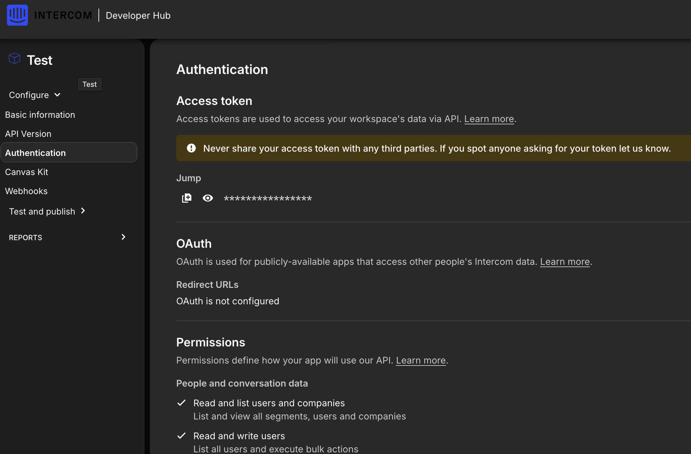
- Setup `INTERCOM_SECRET` on your .env file
- From the Intercom ui ( Not developer hub ) go to Settings > Integrations > Actions > Create new Action
  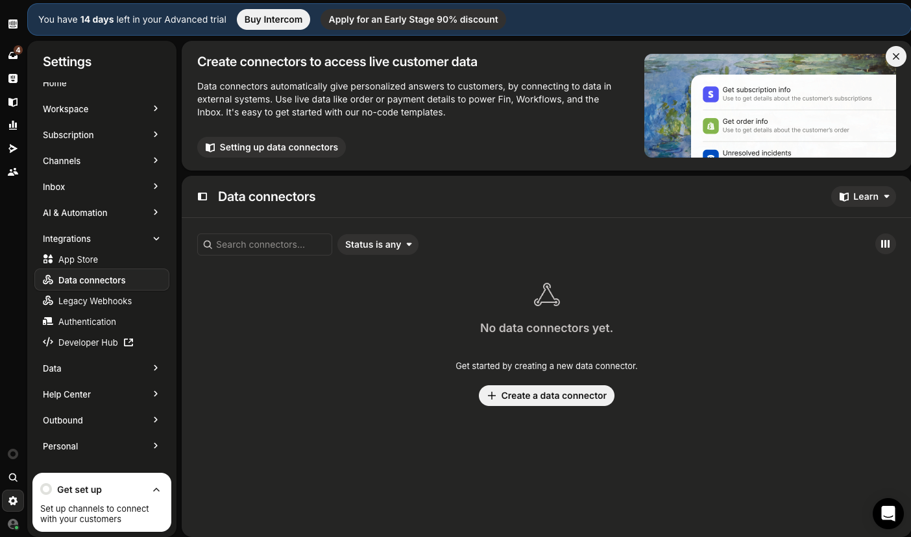
- In usage select Workflows and Help Desk
- In API Connection set it do a post request to the deployed app at /api/submit and include the headers and request body from the screenshot.
  - If you want to hook up the intercom request to your local machine on dev before you make an actual deployment, you can use some reverse tunnel service like ngrok or cloudflare tunnels, but you could also just call the controller directly from iex
- With these settings you can click "save and set live"
- In order for the done notifier to work, you also need to set `INTERCOM_ADMIN_ID`. Feel free to use the helper `JumpTickets.External.Intercom.get_admin_details` to list all the available admins ( either remote attach or simple `iex run -S mix phx.server`)
  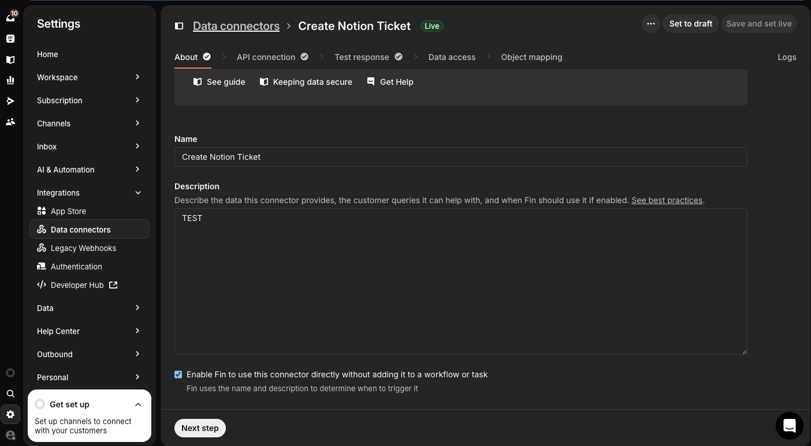
  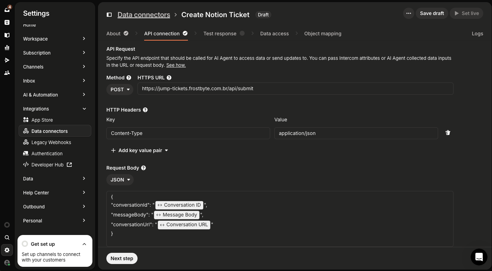
- To test it just visit inbox, click on the three dots on any message and look for "trigger custom action". Sometimes the list of actions is not hydrated and you might need to type something like "notion" in the searchbox for it to show up

## Setup Anthropic

- Right now the project uses Claude-3.5-haiku for deciding between existing tickets, set the API key `CLAUDE_SECRET`

## Setup notion

- Create a new integration https://www.notion.so/profile/integrations and copy its secret
- Grab the secret key and set `NOTION_SECRET`
- Create a new database on notion, it should have these fields:
  - 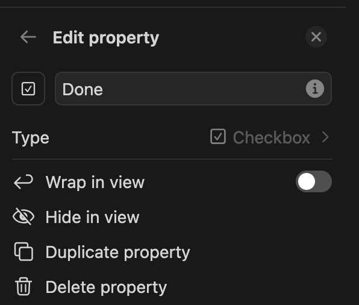
  - 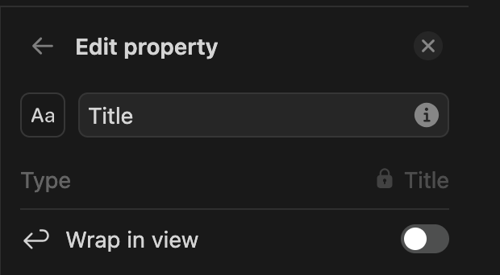
  - This one is an ID type, set the prefix to JMP when configuring it 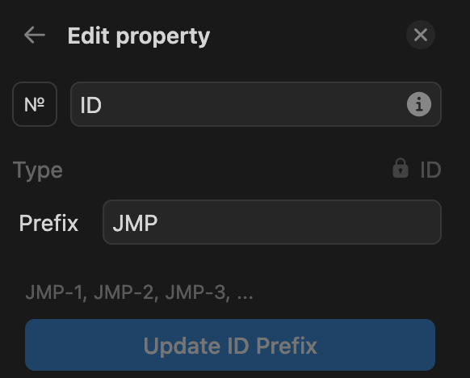
  - 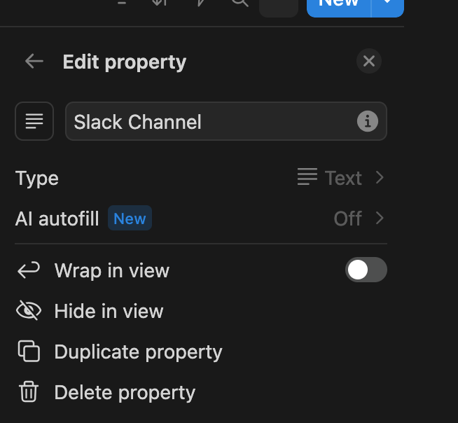
  - 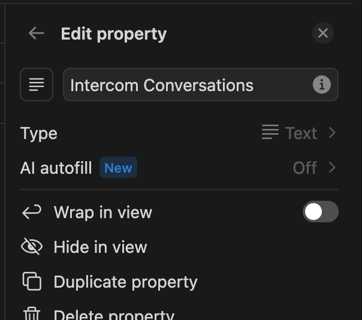
- Here's what it should look like at the end of this process 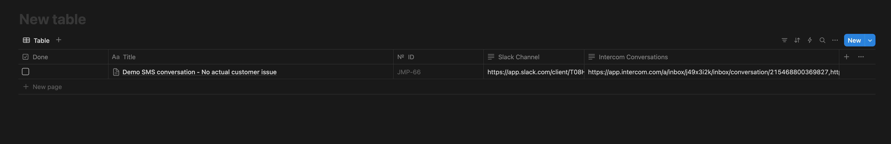
- Add the integration to the db file by clicking on the three dots on the page and choosing the app you created under Connections. Allow access to this page and child pages when asked
  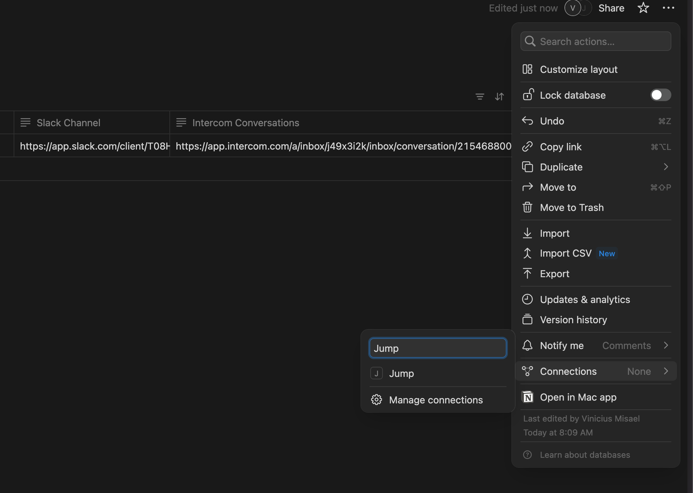
- Grab db id and set `NOTION_DB_ID`

## Setup Slack

- Create slack app at https://api.slack.com/apps and navigate to OAuth and Permissions
- Set the following oauth scopes and generate token

  ```
  channels:manage
  channels:read
  channels:write.invites
  chat:write
  users:read
  users:read.email
  ```

- Set `SLACK_BOT_TOKEN` with the value from the previous step
  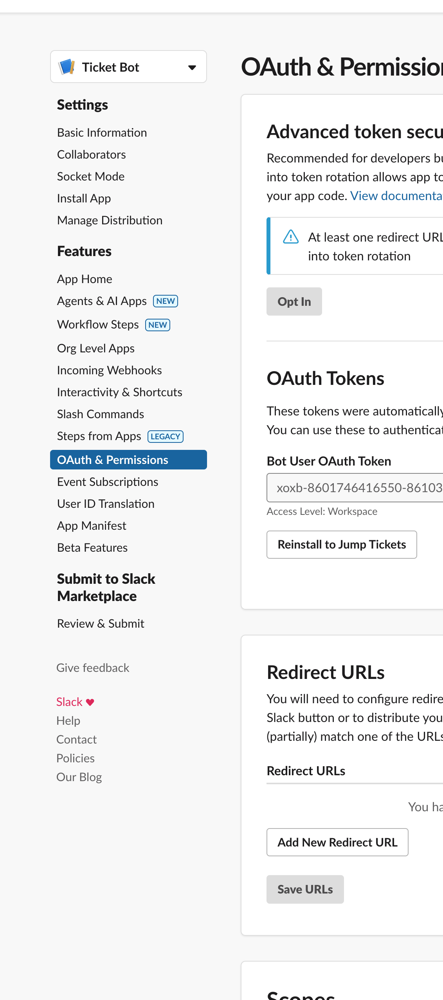

## Testing

- Start with iex -S mix phx.server

```elixir
JumpTickets.IntegrationRequest.create_integration_request(%{
  conversation_id: <you can grab this from the intercom conversation, it's the last url part and looks like 215468800369841>,
  conversation_url: conversation_url,
  message_body: message_body
})
```

- Visit localhost:4000 ( the http basic auth creds are set with AUTH_USERNAME and AUTH_PASSWORD )

## Local

- Copy .env.template to .env && source it
- mix setup
- mix phx.server

## Deploy

- Copy .env.template to .env
- Set `PHX_HOST` to the url the base app is hosted on
- Set `SECRET_KEY_BASE` to the result of `mix phx.gen.secret`
- Set `MIX_ENV` to "prod"
  ```
    $ source .env
    $ mix deps.get
    $ mix assets.deploy
    $ mix release
    $  _build/prod/rel/jump_tickets/bin/jump_tickets start
  ```

## Integration Logic

- You can inspect the running requests with the functions under the IntegrationRequest context ( like JumpTickets.IntegrationRequest.list_integration_requests() )

```elixir
# Sample request for reference
%JumpTickets.IntegrationRequest.Request{
  id: nil,
  intercom_conversation_id: "2",
  intercom_conversation_url: "https://new-test.example.com",
  message_body: "What is happening?",
  status: :completed,
  steps: %{
    check_existing_tickets: %JumpTickets.IntegrationRequest.Step{
      type: :check_existing_tickets,
      status: :completed,
      started_at: ~U[2025-03-16 18:16:13.845786Z],
      completed_at: ~U[2025-03-16 18:16:14.641125Z],
      error: nil,
      result: [
        %JumpTickets.Ticket{
          __meta__: #Ecto.Schema.Metadata<:built, "tickets">,
          id: nil,
          notion_id: "1b8d3c1b-90d3-81ab-abae-f453c9ef24cc",
          notion_url: "https://www.notion.so/Test-Conversation-WhatsApp-Channel-Setup-Demonstration-1b8d3c1b90d381ababaef453c9ef24cc",
          ticket_id: "JMP-29",
          title: "Test Conversation - WhatsApp Channel Setup Demonstration",
          intercom_conversations: "https://test.com",
          summary: nil,
          slack_channel: "https://app.slack.com/client/T08HPMYC8G6/C08J8FYMNQH?entry_point=nav_menu"
        }
      ]
    },
    ai_analysis: %JumpTickets.IntegrationRequest.Step{
      type: :ai_analysis,
      status: :completed,
      started_at: ~U[2025-03-16 18:16:14.641136Z],
      completed_at: ~U[2025-03-16 18:16:21.214706Z],
      error: nil,
      result: {:existing,
       %JumpTickets.Ticket{
         __meta__: #Ecto.Schema.Metadata<:built, "tickets">,
         id: nil,
         notion_id: "1b8d3c1b-90d3-81ab-abae-f453c9ef24cc",
         notion_url: "https://www.notion.so/Test-Conversation-WhatsApp-Channel-Setup-Demonstration-1b8d3c1b90d381ababaef453c9ef24cc",
         ticket_id: "JMP-29",
         title: "Test Conversation - WhatsApp Channel Setup Demonstration",
         intercom_conversations: "https://test.com",
         summary: nil,
         slack_channel: "https://app.slack.com/client/T08HPMYC8G6/C08J8FYMNQH?entry_point=nav_menu"
       }}
    },
    create_or_update_notion_ticket: %JumpTickets.IntegrationRequest.Step{
      type: :create_or_update_notion_ticket,
      status: :completed,
      started_at: ~U[2025-03-16 19:37:43.331492Z],
      completed_at: ~U[2025-03-16 19:37:44.668251Z],
      error: nil,
      result: %JumpTickets.Ticket{
        __meta__: #Ecto.Schema.Metadata<:built, "tickets">,
        id: nil,
        notion_id: "1b8d3c1b-90d3-81ab-abae-f453c9ef24cc",
        notion_url: "https://www.notion.so/Test-Conversation-WhatsApp-Channel-Setup-Demonstration-1b8d3c1b90d381ababaef453c9ef24cc",
        ticket_id: "JMP-29",
        title: "Test Conversation - WhatsApp Channel Setup Demonstration",
        intercom_conversations: "https://new-test.example.com,https://test.com",
        summary: nil,
        slack_channel: "https://app.slack.com/client/T08HPMYC8G6/C08J8FYMNQH?entry_point=nav_menu"
      }
    },
    maybe_create_slack_channel: %JumpTickets.IntegrationRequest.Step{
      type: :maybe_create_slack_channel,
      status: :completed,
      started_at: ~U[2025-03-16 19:37:44.668263Z],
      completed_at: ~U[2025-03-16 19:37:44.668287Z],
      error: nil,
      result: %{
        url: "https://app.slack.com/client/T08HPMYC8G6/C08J8FYMNQH?entry_point=nav_menu",
        channel_id: "C08J8FYMNQH"
      }
    },
    maybe_update_notion_with_slack: %JumpTickets.IntegrationRequest.Step{
      type: :maybe_update_notion_with_slack,
      status: :completed,
      started_at: ~U[2025-03-16 19:37:44.668292Z],
      completed_at: ~U[2025-03-16 19:37:45.421927Z],
      error: nil,
      result: %JumpTickets.Ticket{
        __meta__: #Ecto.Schema.Metadata<:built, "tickets">,
        id: nil,
        notion_id: "1b8d3c1b-90d3-81ab-abae-f453c9ef24cc",
        notion_url: "https://www.notion.so/Test-Conversation-WhatsApp-Channel-Setup-Demonstration-1b8d3c1b90d381ababaef453c9ef24cc",
        ticket_id: "JMP-29",
        title: "Test Conversation - WhatsApp Channel Setup Demonstration",
        intercom_conversations: "https://new-test.example.com,https://test.com",
        summary: nil,
        slack_channel: "https://app.slack.com/client/T08HPMYC8G6/C08J8FYMNQH?entry_point=nav_menu"
      }
    },
    add_intercom_users_to_slack: %JumpTickets.IntegrationRequest.Step{
      type: :add_intercom_users_to_slack,
      status: :completed,
      started_at: ~U[2025-03-16 19:37:45.421939Z],
      completed_at: ~U[2025-03-16 19:37:47.775819Z],
      error: nil,
      result: nil
    }
  },
  created_at: ~U[2025-03-16 18:16:13.845205Z],
  updated_at: ~U[2025-03-16 19:37:47.775832Z],
  context: %{}
}
```
